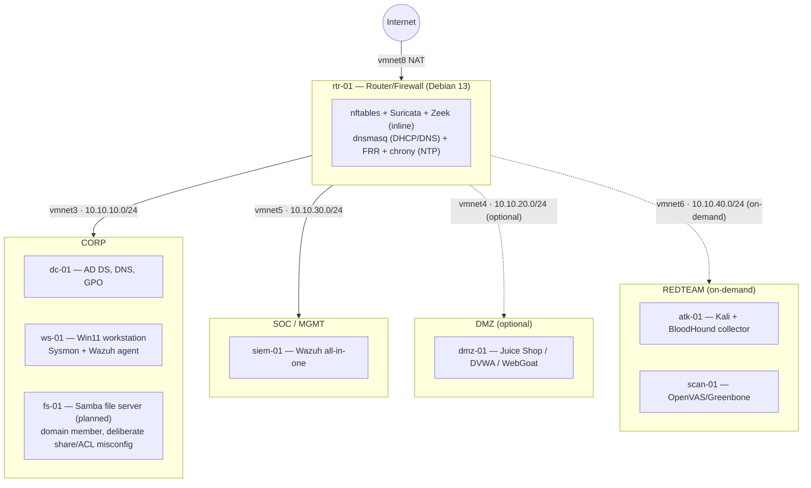

# Cybersecurity Homelab

A segmented, reproducible security lab built on Apple Silicon (VMware Fusion, ARM64-only) — Active Directory, a hand-built Linux router/firewall, Wazuh SIEM, and a full detection-engineering loop from attack simulation to written detection to evasion attempt.

> **Status: Phase 4 (Detection engineering) in progress.** 2 of 8–12 target ATT&CK techniques verified end-to-end (custom rule → true positive → evasion attempt), plus a real SCA before/after remediation pass — see [`phase-4-detection/detection-catalog.md`](phase-4-detection/detection-catalog.md). Full build plan and design rationale: [`docs/`](docs/).

## Architecture

## Skills demonstrated

- **Network engineering** — segmentation, firewalling, and routing built from an empty `nftables` ruleset, not a GUI firewall product
- **Identity infrastructure** — Active Directory forest design, GPO, and deliberately-introduced, documented misconfigurations
- **Detection engineering** — ATT&CK-mapped rules written and verified against real attack simulation (Atomic Red Team), including evasion attempts
- **SOC operations** — Wazuh SIEM tuning, FIM, SCA benchmarking, active response
- **Offensive security in context** — AD attack-path mapping (BloodHound) through to an executed technique through to detection
- **Network security monitoring** — paired Suricata + Zeek analysis, PCAP investigation
- **Infrastructure as code** — Ansible-driven rebuild of the entire lab

## Build phases

| Phase | Focus | Status |
|---|---|---|
| 0 | Foundation | ✅ Complete |
| 1 | Routing & segmentation | ✅ Complete |
| 2 | Identity (Active Directory) | ✅ Complete |
| 3 | Visibility (Wazuh) | ✅ Complete |
| 4 | Detection engineering | ⬜ In progress |
| 5 | Offense in context | ⬜ |
| 6 | Network security monitoring | ⬜ |
| 7 | Automation | ⬜ |

Full IP plan, naming convention, and design rationale: [`docs/00-ip-plan.md`](docs/00-ip-plan.md), [`docs/design-decisions.md`](docs/design-decisions.md).
