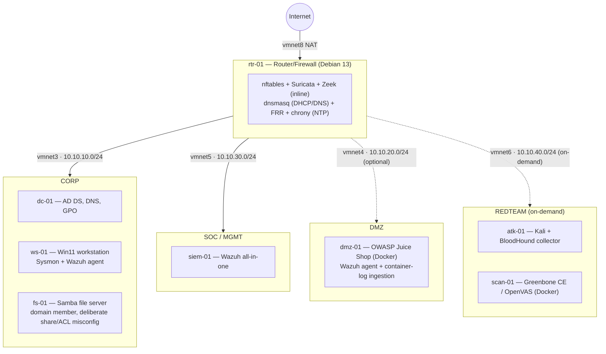

# Cybersecurity Homelab

[](https://github.com/tohudgins/Homelab/actions/workflows/ci.yml)
[](LICENSE)
[](phase-4-detection/detection-catalog.md)
[](phase-7-automation/ansible/)

A segmented, reproducible security lab built on Apple Silicon (VMware Fusion, ARM64-only) — Active Directory, a hand-built Linux router/firewall, Wazuh SIEM, and a full detection-engineering loop from attack simulation to written detection to evasion attempt.

> **Status: all 8 build phases (0–7) complete.** The detection catalog runs to **52 ATT&CK techniques** — 51 verified end-to-end live-fire (including T1047 WMI and T1098.007 AD group-membership logging, both root-caused and fixed 2026-09-12 after prior investigations left them genuinely unresolved, and T1548.003 sudo/GTFOBins privesc, the lab's first Linux-native offense/detection pair) and 3 confirmed correct by inspection or by a confirmed defense-in-depth block (LSASS PPL, certutil, PsExec-vs-Defender) — spanning 13 of ATT&CK's 14 tactics ([`phase-4-detection/detection-catalog.md`](phase-4-detection/detection-catalog.md)), plus an SCA before/after remediation pass. A capstone end-to-end intrusion emulation (`phase-5-offense/apt-scenario/`) chains 7 of those phases into one detected kill chain, scored **11/12** on a genuine fresh full re-run with all 7 non-scan hosts up (the sole miss is LSASS comsvcs, confirmed Defender-blocked before it can even run) ([`run-scenario.sh --verify`](phase-5-offense/apt-scenario/run-scenario.sh)). Phase 5 maps AD attack paths in BloodHound and executes one from a Kali box back into detection — with an honest writeup of where Linux offensive tooling does and doesn't work against a Samba DC ([`phase-5-offense/attack-detect-writeups/`](phase-5-offense/attack-detect-writeups/)). Phase 6 pairs Suricata + Zeek NSM; Phase 7 is full Ansible IaC (`site.yml` converges all seven hosts at `changed=0`). A [CI pipeline](.github/workflows/ci.yml) statically validates every committed artifact on each push — Ansible (syntax-check + `ansible-lint`), the Sigma detections, the Wazuh rules/decoders, Python and shell tooling, and a `gitleaks` secret scan. A [docs site](https://tohudgins.github.io/Homelab/) ([`mkdocs.yml`](mkdocs.yml)) publishes the whole catalog, and the [ATT&CK coverage map loads directly into Navigator](phase-4-detection/attack-coverage/README.md#view-it) from a link — no manual upload. Remaining portfolio work is a walkthrough video. Full build plan and design rationale: [`docs/`](docs/).

## Architecture



## Skills demonstrated

- **Network engineering** — segmentation, firewalling, and routing built from an empty `nftables` ruleset, not a GUI firewall product
- **Identity infrastructure** — Active Directory forest design, GPO, and deliberately-introduced, documented misconfigurations
- **Detection engineering** — ATT&CK-mapped rules written and verified against real attack simulation (Atomic Red Team), including evasion attempts
- **SOC operations** — Wazuh SIEM tuning, FIM, SCA benchmarking, active response
- **Offensive security in context** — AD attack-path mapping (BloodHound) through to an executed technique through to detection
- **Network security monitoring** — paired Suricata + Zeek analysis, PCAP investigation
- **Infrastructure as code** — Ansible-driven rebuild of the entire lab

## Running the lab

The lab is driven as a platform, not a pile of VMs — a `make` control surface over
VMware Fusion + Ansible:

```bash
make up PROFILE=soc     # start a run profile (networking|ad|soc|attack|vulnscan|services)
make converge           # ansible-playbook site.yml — bring the whole lab to desired state
make status             # power state of every VM
make down               # suspend everything
```

Full operator guide — running a simulation, the detection loop, **and how to add a
new host/segment (the scalability path)** — in [`docs/RUNBOOK.md`](docs/RUNBOOK.md).

## Build phases

| Phase | Focus | Status |
|---|---|---|
| 0 | Foundation | ✅ Complete |
| 1 | Routing & segmentation | ✅ Complete |
| 2 | Identity (Active Directory) | ✅ Complete |
| 3 | Visibility (Wazuh) | ✅ Complete |
| 4 | Detection engineering | ✅ Complete (52 techniques across 13 tactics, 51 verified end-to-end live-fire, `phase-4-detection/detection-catalog.md`) |
| 5 | Offense in context | ✅ Complete (BloodHound low-priv→Tier0 path executed end-to-end from atk-01 — fs-01 bait credential → Backup Operators/DCSync → Kerberoast; **all three detections re-verified firing live** (rules 100090/100031/100080), and the re-verify found + fixed a real Kerberoast-rule off-by-one — see `phase-5-offense/attack-detect-writeups/`) |
| 6 | Network security monitoring | ✅ Complete (Suricata + Zeek inline on rtr-01; **2 PCAP analysis reports** in `phase-6-nsm/pcap-reports/` — the Phase-5 AD attack chain and an nmap recon scan — each pairing Suricata signatures with Zeek protocol/connection logs and the Wazuh host view; both re-verified live. Headline: signature IDS and protocol-aware NSM go blind on *different* traffic, so you run both) |
| 7 | Automation | ✅ Complete (Ansible IaC — **all seven hosts** covered: `router`/`dc`/`siem`/`dmz`/`fileserver`/`windows` (ws-01 over SSH) + `scan` (scan-01, Greenbone CE vuln scanner); `site.yml` converges the entire lab at `changed=0`; **dmz-01 and scan-01** stood up from blank disks via headless Ubuntu autoinstall) |

Full IP plan, naming convention, and design rationale: [`docs/00-ip-plan.md`](docs/00-ip-plan.md), [`docs/design-decisions.md`](docs/design-decisions.md).
