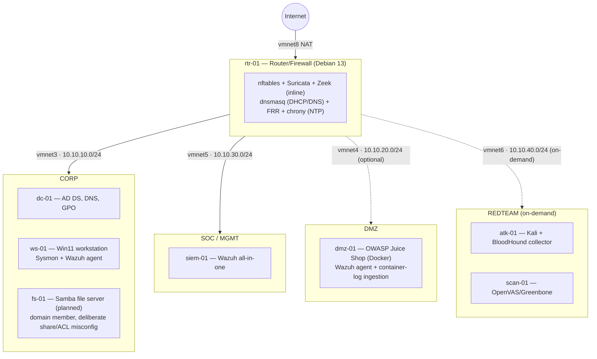

# Cybersecurity Homelab

A segmented, reproducible security lab built on Apple Silicon (VMware Fusion, ARM64-only) — Active Directory, a hand-built Linux router/firewall, Wazuh SIEM, and a full detection-engineering loop from attack simulation to written detection to evasion attempt.

> **Status: Phase 5 (Offense in context) — in progress.** Phase 4 delivered 12 ATT&CK techniques verified end-to-end (Credential Access, Persistence, Defense Evasion, Execution across dc-01/rtr-01 Linux/AD and ws-01 Windows/Sysmon), plus an SCA before/after remediation pass — see [`phase-4-detection/detection-catalog.md`](phase-4-detection/detection-catalog.md). Phase 5 maps AD attack paths in BloodHound, executes one from a Kali attacker box, and closes the loop back into detection — including **two new custom detections** (DCSync, and credential-theft on the fs-01 weak share) — with an honest writeup of where Linux offensive tooling does and doesn't work against a Samba DC: [`phase-5-offense/attack-detect-writeups/`](phase-5-offense/attack-detect-writeups/). Full build plan and design rationale: [`docs/`](docs/).

## Architecture

## Skills demonstrated

- **Network engineering** — segmentation, firewalling, and routing built from an empty `nftables` ruleset, not a GUI firewall product
- **Identity infrastructure** — Active Directory forest design, GPO, and deliberately-introduced, documented misconfigurations
- **Detection engineering** — ATT&CK-mapped rules written and verified against real attack simulation (Atomic Red Team), including evasion attempts
- **SOC operations** — Wazuh SIEM tuning, FIM, SCA benchmarking, active response
- **Offensive security in context** — AD attack-path mapping (BloodHound) through to an executed technique through to detection
- **Network security monitoring** — paired Suricata + Zeek analysis, PCAP investigation
- **Infrastructure as code** — Ansible-driven rebuild of the entire lab

## Build phases

| Phase | Focus | Status |
|---|---|---|
| 0 | Foundation | ✅ Complete |
| 1 | Routing & segmentation | ✅ Complete |
| 2 | Identity (Active Directory) | ✅ Complete |
| 3 | Visibility (Wazuh) | ✅ Complete |
| 4 | Detection engineering | ✅ Complete (12 techniques) |
| 5 | Offense in context | 🔄 In progress (BloodHound path → executed → DCSync + credential-theft detections) |
| 6 | Network security monitoring | 🔄 In progress (Suricata + Zeek inline; attack-chain PCAP analysis correlating signature/protocol/host) |
| 7 | Automation | ✅ Complete (Ansible IaC — **all six hosts** covered: `router`/`dc`/`siem`/`dmz`/`fileserver` + `windows` (ws-01 over SSH); `site.yml` converges the entire lab at `changed=0`; **dmz-01** stood up from a blank disk via headless Ubuntu autoinstall) |

Full IP plan, naming convention, and design rationale: [`docs/00-ip-plan.md`](docs/00-ip-plan.md), [`docs/design-decisions.md`](docs/design-decisions.md).
