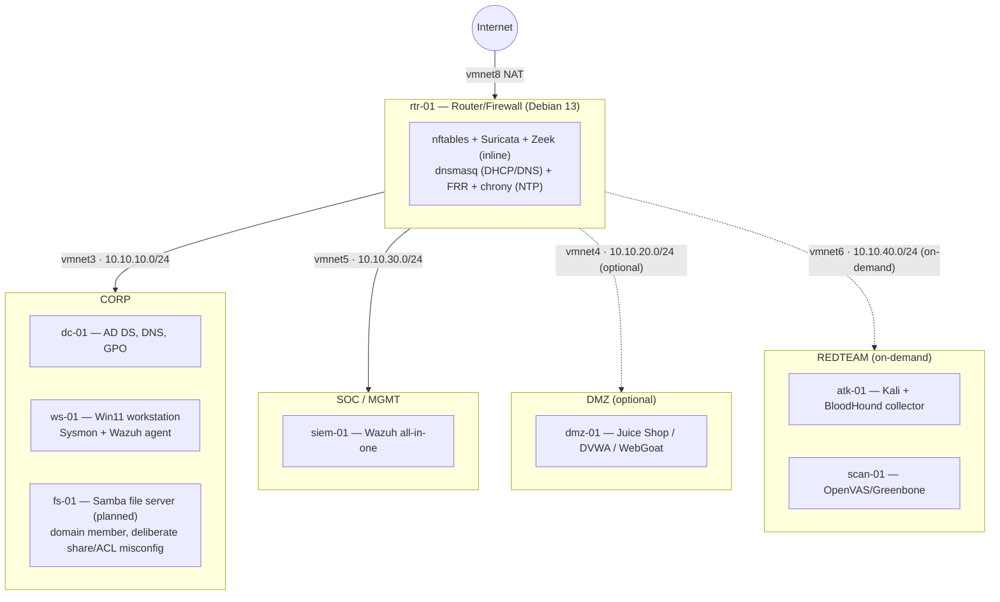

# Network Diagram

## Reading it

- **Solid lines** are always-on segments (CORP, SOC). **Dashed lines** are optional (DMZ) or on-demand (REDTEAM) — never all running at once; see the run-profile table in the build plan.
- **rtr-01 is the only host with a leg in every segment**; every other host is single-homed.
- **SOC never initiates connections outward** except to reach agents for enrollment/data — it reaches everything, nothing reaches back in except the two Wazuh agent ports (see `00-ip-plan.md`).
- **REDTEAM can reach CORP and DMZ, never SOC** — the SIEM observing the attack must not be reachable by the box generating it.
