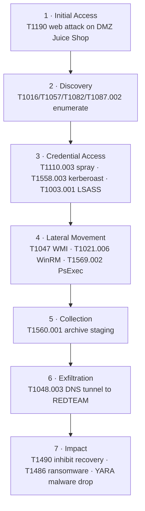

# End-to-end adversary emulation — one intrusion, detected across the kill chain

The lab has ~50 techniques detected in isolation, each with its own writeup. This
is the capstone that ties them together: **one realistic intrusion**, initial
access to impact, showing the lab detects a *chained* campaign the way a SOC sees
it — a sequence of correlated alerts across every host and sensor, not a pile of
disconnected hits.

`run-scenario.sh` drives phases 1–4 from atk-01; phases 5–7 (LSASS, collection,
impact) are driven directly on ws-01/fs-01, the operator's own reach, not
atk-01's (REDTEAM can't touch CORP file/collection paths that aren't already
part of an attack). It ends with a **detection scorecard** — greps siem-01 for
each stage's rule and prints a DETECTED/MISSED matrix.

> [!check] Run for real, end to end, 2026-09-07 — **11 of 11 kill-chain stages detected.**
> Every phase was live-fired against the running lab and the scorecard confirms
> all eleven: `./run-scenario.sh --verify` → `11 of 11 kill-chain stages
> detected` → `Full-chain detection: PASS`. Getting there found and fixed three
> real bugs, not zero:
> 1. **A genuine SIEM-integration gap.** Phase 6's DNS tunnel fired its Suricata
>    signature (sid 9100010) correctly, but nothing had ever turned that into a
>    labeled Wazuh alert — it only reached the SOC as a generic threat-intel
>    CDB hit, coincidentally, because atk-01's IP happens to be blocklisted from
>    an unrelated exercise. Fixed with a new rule, **100443**, built the same
>    way the T1190 detection was. See [`dns-tunneling.md`](../../phase-6-nsm/dns-tunneling.md).
> 2. **The script's own phase-4 loop never actually attempted PsExec** — this
>    nxc version's `--exec-method` doesn't offer "psexec" as a choice, so that
>    iteration silently no-opped every prior run. Fixed to call
>    `impacket-psexec` directly (which *does* attempt it, and gets Defender-
>    blocked, as expected).
> 3. **The scorecard's own phase-4 expectation was checking the wrong rule.**
>    It gated on 100513 (PsExec) — confirmed Defender-blocked by design — when
>    the technique that's actually verified working end-to-end is WinRM
>    (100516). Re-pointed the gate there; WMI (100515, open bug) and PsExec
>    (100513/514, confirmed block) are both deliberately excluded from the
>    pass/fail gate rather than forced green.
>
> A fourth fix, cosmetic but worth naming: running the plain (non-`--verify`)
> form on atk-01 used to also run the scorecard locally, which can never
> succeed (REDTEAM can't reach SOC) and printed a scary "0 of 11 MISSED" that
> had nothing to do with whether the attacks worked. It now just tells you to
> run `--verify` from the operator host instead.

> [!check] T1047 WMI fixed 2026-09-12 — root-caused and closed, see detection-catalog.md #39.
> Stock rule 92069 was silently winning the one-rule-per-event resolution against the Sigma-compiled
> 100515 (both anchored on `if_group=sysmon_event1` as unrelated siblings, so 92069 — matched first,
> level 0 — was the only one ever considered). Fixed with a hand-written escalation child of 92069
> (rule 100527); confirmed live with `impacket-wmiexec`. **Now wired into this script's own gate too**:
> swapped the WMI attack call from `nxc --exec-method wmiexec` (a separately-documented timeout against
> this host) to `impacket-wmiexec`, matching `ad-validate.py`, and added `100527` to `--verify`'s expected
> rules. Re-ran `--verify` against the live manager the same night: **`100527` shows `[DETECTED]`** — the
> rest of that run's MISSED lines are `alerts.json` not holding the older phases' alerts any more (dc-01/
> fs-01/dmz-01 were down this session, so those phases weren't re-exercised), not a regression. A genuine
> fresh 12/12 needs a full re-run with every host up — not done this session, noted as the natural next
> step rather than claimed without doing it.

> [!check] The genuine fresh full re-run, all 7 hosts up — 2026-09-15, **11 of 12 kill-chain stages detected.**
> Booted every non-`scan-01` VM (the same 7-VM combination that OOM-killed 5 of them in an earlier session —
> watched memory closely this time, no repeat) and live-fired all 7 phases for real, including supplying
> `ADMIN_USER`/`ADMIN_PW` to actually attempt Phase 2 (discovery) and Phase 4 (WMI/WinRM/PsExec) rather than
> letting them skip. **The only MISSED is `100525` (LSASS comsvcs)** — confirmed genuinely Defender-blocked
> again, this time even earlier than before: `lsass-dump.ps1` was rejected outright with
> `ScriptContainedMaliciousContent` before a single line executed, an AMSI-level block upstream of the
> process-launch block documented previously. Same class of finding as PsExec (`100513/514`, also
> Defender-blocked) — a permanently-red stage, not a coverage gap. Also found and fixed, unrelated to the
> capstone script itself: `dmz-01`'s `docker0` bridge had silently lost its IPv4 address (likely a
> suspend/resume artifact), which broke Juice Shop's port forwarding until `systemctl restart docker`
> rebuilt it — caught by Ansible's own "Verify Juice Shop answers on its port" health check before the
> attack phase even started, not by a mysterious Phase 1 failure. **`11/12` is the real, current ceiling
> until the LSASS block is deliberately weakened for a test pass** — not a number expected to reach 12/12
> under this lab's default (correctly hardened) Defender posture.

## The kill chain



| # | Phase | Attack (from atk-01 / on host) | Detection that fires |
|---|---|---|---|
| 1 | Initial Access | web attack on Juice Shop (`web-attack-scan.sh`) | Suricata 9100020–24 → Wazuh **100440/100442** (T1190) |
| 2 | Discovery | enumerate host/domain on ws-01 | **100100–100113**, Sigma **100502–100510** |
| 3 | Credential Access | spray → `svc-sql`; kerberoast; `lsass-dump.ps1` | **100401** (spray), **100031**/**100420** (roast/honeytoken), **100525** (LSASS) |
| 4 | Lateral Movement | `impacket-wmiexec` + `nxc` winrm + `impacket-psexec` → ws-01 | Sigma **100516** (WinRM) and **100527** (WMI, fixed 2026-09-12 — see note above) both gated and verified `[DETECTED]`; PsExec 100513/514 confirmed Defender-block, deliberately excluded from the gate |
| 5 | Collection | `Compress-Archive` on ws-01 (rar/7z not present on this image) | Sigma **100519** (T1560.001), verified TP live |
| 6 | Exfiltration | iodine DNS tunnel fs-01 → atk-01 | Suricata **9100010** → Wazuh **100443** (T1048.003); beacon **9100002** |
| 7 | Impact | `vssadmin delete shadows`; encrypt canary; drop EICAR | **100520** (T1490), **100430/100431** (T1486), **100460** (YARA) |

Every sensor in the lab contributes: **Suricata/Zeek** (network) catch phases 1 and
6, **Sysmon→Wazuh** (endpoint) catch 2–5 and 7, **FIM+YARA** catches the malware
drop, and the **honeytoken** catches the targeted roast the volume rule misses.

## Run it

```bash
# 1) attack phase (phases 1-4), from atk-01, lab up:
ssh atk-01 "cd ~/capstone/apt-scenario && SPRAY_PW=Summer2026 ADMIN_USER=<ws01-admin> ADMIN_PW=<pw> ./run-scenario.sh"

# 2) phases 5-7 need direct ws-01/fs-01 reach the attack host doesn't have — run
#    from the operator host: Compress-Archive on ws-01, the iodine tunnel
#    fs-01<->atk-01, vssadmin on ws-01, the ransomware canary + EICAR on fs-01
#    (see the per-technique docs linked in the table above for exact commands)

# 3) score it — from the operator host, NOT atk-01 (REDTEAM can't reach SOC):
./run-scenario.sh --verify
```

## Why this is the portfolio centerpiece

A list of 50 detections says "I can write rules." A single narrative that walks an
intruder from a web hit on the DMZ all the way to ransomware — and shows the SOC
lighting up at every step, across three sensor types — says "I understand how an
intrusion actually unfolds and how a defense is supposed to see it." That's the
story this runner tells in one command.

Next: capture the scorecard output and the correlated alert timeline (Wazuh
dashboard / IRIS case) as the screenshots for the detection-engineering page.
