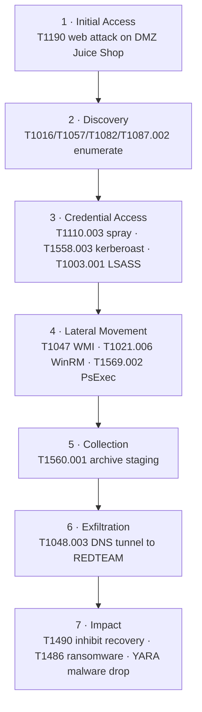

# End-to-end adversary emulation — one intrusion, detected across the kill chain

The lab has ~50 techniques detected in isolation, each with its own writeup. This
is the capstone that ties them together: **one realistic intrusion**, initial
access to impact, showing the lab detects a *chained* campaign the way a SOC sees
it — a sequence of correlated alerts across every host and sensor, not a pile of
disconnected hits.

`run-scenario.sh` drives it from atk-01 and ends with a **detection scorecard** —
it greps siem-01 for each stage's rule and prints a DETECTED/MISSED matrix.

> [!warning] Built 2026-09-06 — runs against the live lab.
> This orchestrates real attacks across five hosts and needs the lab powered on
> (`networking+ad+soc+services+attack`) plus credentials. Several stages (LSASS,
> collection, impact) are driven on ws-01/fs-01 directly. It has **not been run
> end-to-end yet** (lab off); the scorecard is the tool that flips every stage to
> verified. Six of the stages use detections added this session that are
> themselves pending first live fire.

## The kill chain



| # | Phase | Attack (from atk-01 / on host) | Detection that fires |
|---|---|---|---|
| 1 | Initial Access | web attack on Juice Shop (`web-attack-scan.sh`) | Suricata 9100020–24 → Wazuh **100440/100442** (T1190) |
| 2 | Discovery | enumerate host/domain on ws-01 | **100100–100113**, Sigma **100502–100510** |
| 3 | Credential Access | spray → `svc-sql`; kerberoast; `lsass-dump.ps1` | **100401** (spray), **100031**/**100420** (roast/honeytoken), **100525** (LSASS) |
| 4 | Lateral Movement | `nxc --exec-method wmiexec/winrm/psexec` → ws-01 | Sigma **100513–100516** (T1047/T1021.006/T1569.002) |
| 5 | Collection | `7z a` / `Compress-Archive` on ws-01 | Sigma **100517–100519** (T1560.001) |
| 6 | Exfiltration | iodine DNS tunnel fs-01 → atk-01 | Suricata **9100010** (T1048.003); beacon **9100002** |
| 7 | Impact | `vssadmin delete shadows`; encrypt canary; drop EICAR | **100520** (T1490), **100430/100431** (T1486), **100460** (YARA) |

Every sensor in the lab contributes: **Suricata/Zeek** (network) catch phases 1 and
6, **Sysmon→Wazuh** (endpoint) catch 2–5 and 7, **FIM+YARA** catches the malware
drop, and the **honeytoken** catches the targeted roast the volume rule misses.

## Run it

```bash
# from atk-01, lab up:
SPRAY_PW=Summer2026 ADMIN_USER=<ws01-admin> ADMIN_PW=<pw> ./run-scenario.sh

# or just re-score a run already executed:
./run-scenario.sh --verify
```

## Why this is the portfolio centerpiece

A list of 50 detections says "I can write rules." A single narrative that walks an
intruder from a web hit on the DMZ all the way to ransomware — and shows the SOC
lighting up at every step, across three sensor types — says "I understand how an
intrusion actually unfolds and how a defense is supposed to see it." That's the
story this runner tells in one command.

Next: once run live, capture the scorecard output and the correlated alert timeline
(Wazuh dashboard / IRIS case) as the screenshots for the detection-engineering page.
